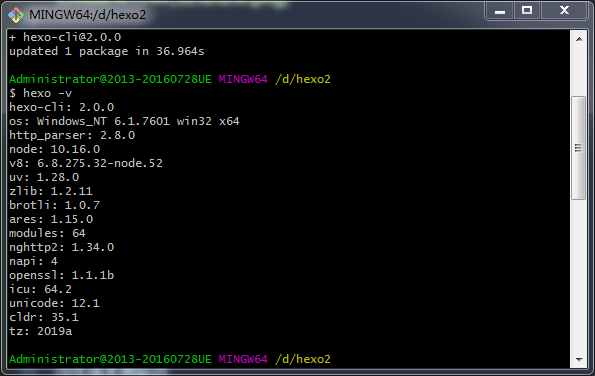
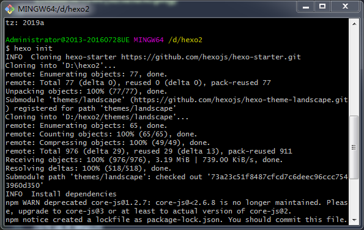
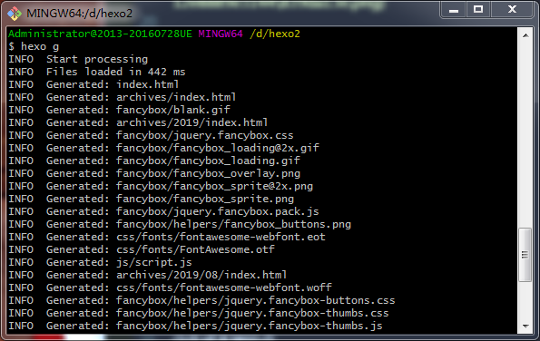
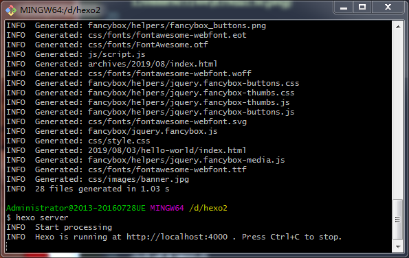
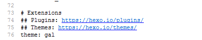

### hexo博客搭建教程

**（以下的操作皆在已安装了git和nodejs的条件下进行。）**

①安装hexo

- 创建一个文件夹，例如blog。
- 在文件夹下右键，点击Git Bash Here。
- 安装hexo,输入：
```
npm install -g hexo-cli
```

- 查看版本，检查是否安装成功：
```
hexo –v
```


②创建hexo

- 初始化博客
```
hexo init
```


- 在你所创建的文件夹下，安装依赖包，输入
```
npm install
```

③生成本地站点

- 生成文件
```
hexo g
```


- 启动服务
```
hexo server
```


④部署GitHub


- 在github中创建一个与用户名名字相同的仓库名，名称后面要加`.github.io`。
- 回到Git Bash Here中，输入：
```
git config --global user.name "yourname"
git config --global user.email "youremail"
```
- 检查是否输入正确：
```
git config user.name
git config user.email
```
- 创建SSH，一路回车，生成.ssh文件夹，找到该文件夹（id_rsa是这台电脑的私人秘钥，id_rsa.pub是公共秘钥。）：
```
ssh-keygen -t rsa -C "youremail"
```
- 在GitHub的setting中 – 点击SSH keys –点击SSH and GPG keys --点击New SSH key，将id_rsa.pub里面的信息复制到GitHub的SSH key中，点击Add SSH key。
- 输入ssh –T git@github.com检验是否成功。
- 安装部署命令，安装后才能使用部署命令部署到GitHub：
```
npm install hexo-deployer-git --save
```
```
hexo clean
hexo g
hexo d
```

- hexo clean：清除缓存文件(db.json)，和已经生成的静态文件(public)。

- hexo g：生成静态文件，每次改动之后都需要执行这个命令。

- hexo d：部署命令。

⑤hexo应用和修改主题

- 开源的hexo主题[Themes \| Hexo](https://hexo.io/themes/)
- 在博客所在的目录，克隆主题，解压，将解压后的文件放到themes中。
- 打开_config.yml文件，配置站点，将主题修改为gal（我这里选的主题是gal）。



- 部署到服务器：
```
hexo g –d
```
- 启动本地服务器，用于预览主题
```
hexo s
```

**注意**
 
- 在目录下的`_config.yml`配置站点。
	- `:`之后必须添加一个空格再写内容，否则会报错。
- 安装的主题可能有一些配置要求，具体要求要看配置说明。


