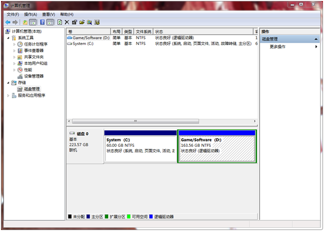
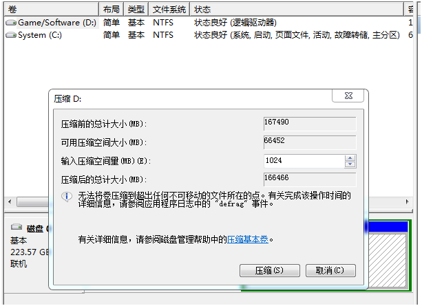
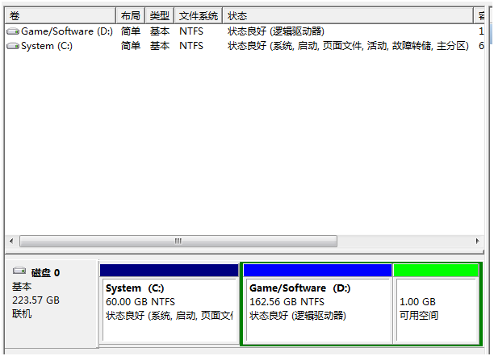
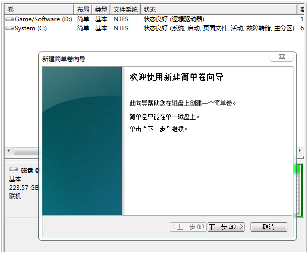
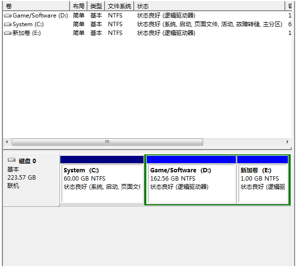
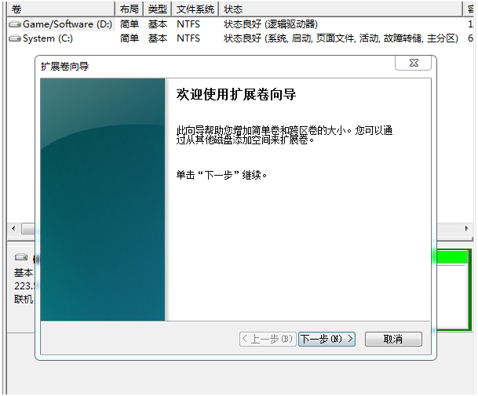
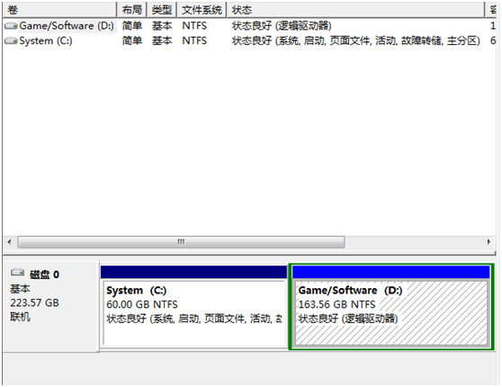

- [在win7系统下，调整磁盘分区](#在win7系统下，调整磁盘分区)
	- [如何给磁盘创建新的分区](#如何给磁盘创建新的分区)
	- [如何合并相邻两个磁盘](#如何合并相邻两个磁盘)

### 在win7系统下，调整磁盘分区

**首先，右键点击计算机—选择管理—点击存储下面的磁盘管理：**

### 如何给磁盘创建新的分区
以图中的D盘为例，选中D盘，右键选择压缩卷，压缩D盘的空间，压缩过后会出现一块多出来的未分配的空间（图中绿色区域）。

右键绿色区域，选择新建简单卷，成功创建新的分区。

### 如何合并相邻两个磁盘
选中上图的E区，右键选择删除卷（操作过程当中需要提前做好文件备份，防止数据丢失），删除过后会多出来一块未分配的区域。

选中D区，右键选择扩展卷，输入未分配区域的大小，成功合并磁盘。

**注意**

扩展卷只能在相邻两个磁盘之间向后扩展。也就是说未分配的空间要在需要扩展卷的磁盘的后面，否则将不能扩展。