### MongDB安装教程及安装遇到的问题

今天下了MongoDB，总结了一下安装过程以及安装当中遇到的问题。

#### 1、首先先从官网上下载MongoDB

[MongoDB](https://www.mongodb.com/)

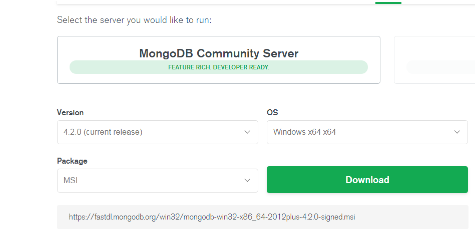

#### 2、Download之后进行安装

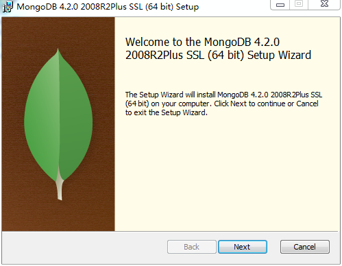

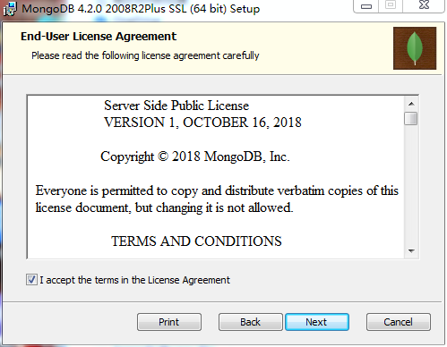

#### 3、选择Custom，可以自定义安装路径

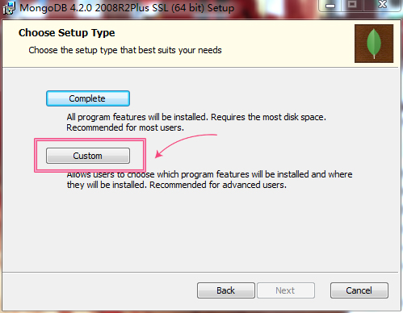

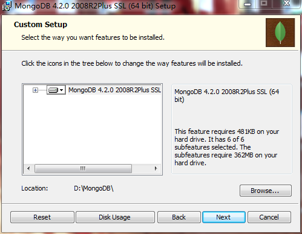

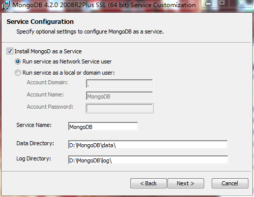

#### 4、下一步安装 "install mongoDB compass" 不勾选，否则可能要很长时间都一直在执行安装，MongoDB Compass 是一个图形界面管理工具，我们可以在后面自己到官网下载安装，下载地址：`https://www.mongodb.com/download-center/compass`。

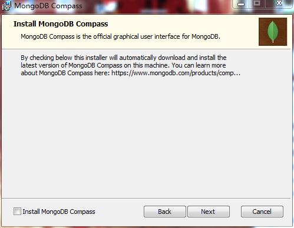

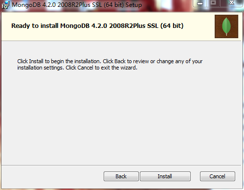

**报错：我在Install的过程当中报错了，显示：**

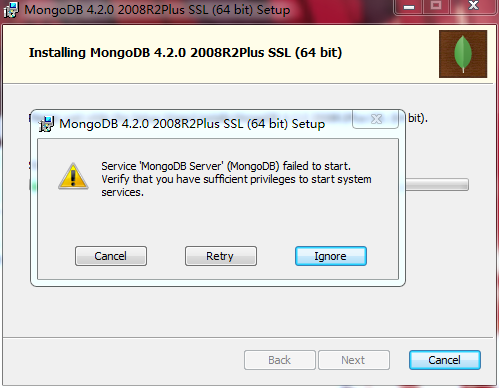

**解决方式：**

点击“Ignore”按钮。

#### 5、接下来打开命令行（或右键Gti Bash Here）进入`D:\MongoDB\bin`目录下，执行`mongod -dbpath D:\MongoDB\data\db`命令（mongod --dbpath 命令是创建数据库文件的存放位置）:

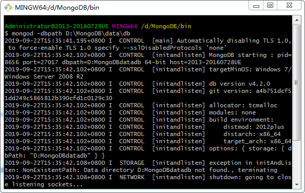

#### 6、然后在bin目录下执行mongo命令，连接数据库

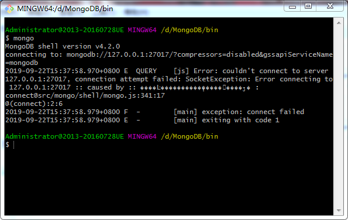

#### 7、打开任务管理器的服务，可以看到MongDB

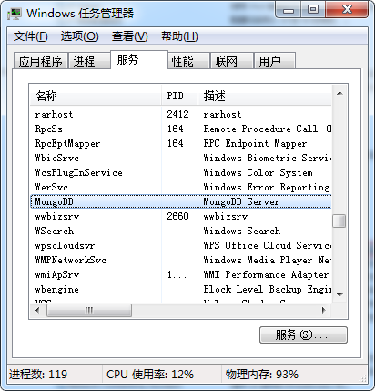